## Sistem Toko Buku Online

## System Requirements

- Java openjdk : Version 17.0.2
- Spring Boot : version 3.4.1
- Database : PostgreSQL
- Maven : Apache Maven 3.9.3
- Editor : Intellij IDEA 2023.1.1 Community Edition
- Postman

## Dependencies

- spring-boot-starter-web
- spring-boot-starter-validation
- spring-boot-devtools
- spring-boot-starter-data-jpa
- postgresql
- jjwt-api
- jackson-databind
- jjwt-impl
- jjwt-jackson
- lombok

---
## DONE

### Authentication 
- Login
- Register
- Refresh Token
- Validasi Token Jwt
- Hash password
- expiry
- role-based access

### Category
- Get All Data Category 
  - Pagination
  - Access User & Admin
- Get Data Category By ID
  - Access User & Admin
- Create Data Category
    - Access Admin Only
- Update Data Category
    - Access Admin Only
- Delete Data Category
    - Access Admin Only

### Book
- Get All Data Book
    - Pagination
    - Access User & Admin
- Get Data Category By ID
    - Access User & Admin
- Create Data Category
    - Access Admin Only
- Update Data Category
    - Access Admin Only
- Delete Data Category
    - Access Admin Only

### Order
- Create Order
    - Transaksi order with multi item
    - Total Price Count automation
    - Validasi Stock
    - Update Stock Book
    - Status PENDING
- Payment Order
    - Status PAID
- Get All Order
    - Pagination
    - User
    - Admin (can view all order)
- Get Detail Order

### Error handling
- implementation Error handling

---
## In Progress
- Reporting
- unit testing
- Date faker

---

## Testing Admin

- Register

  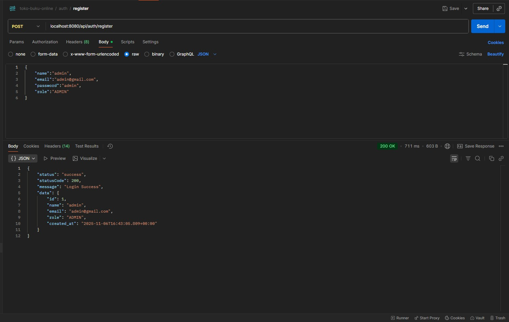

- Login Gagal

  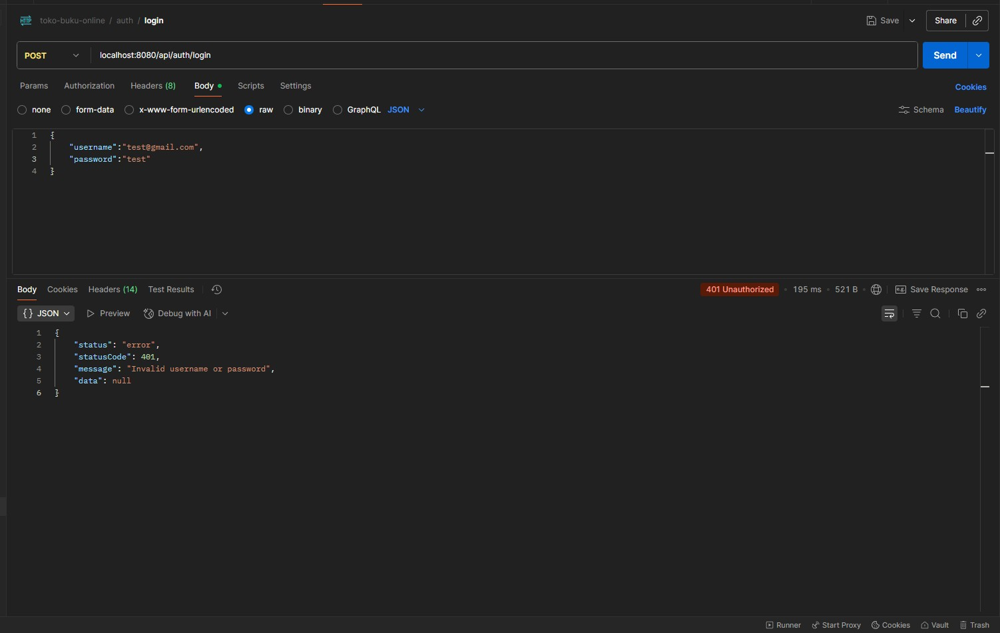

- Login Success

  

- Set Authorization Header Jwt Token

  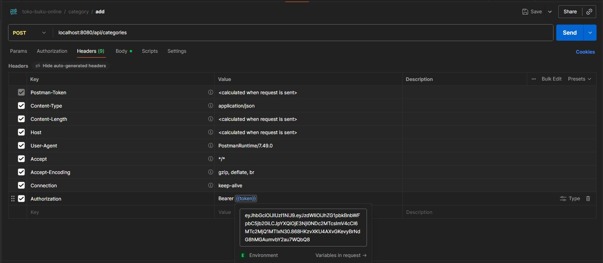

- Create Category

  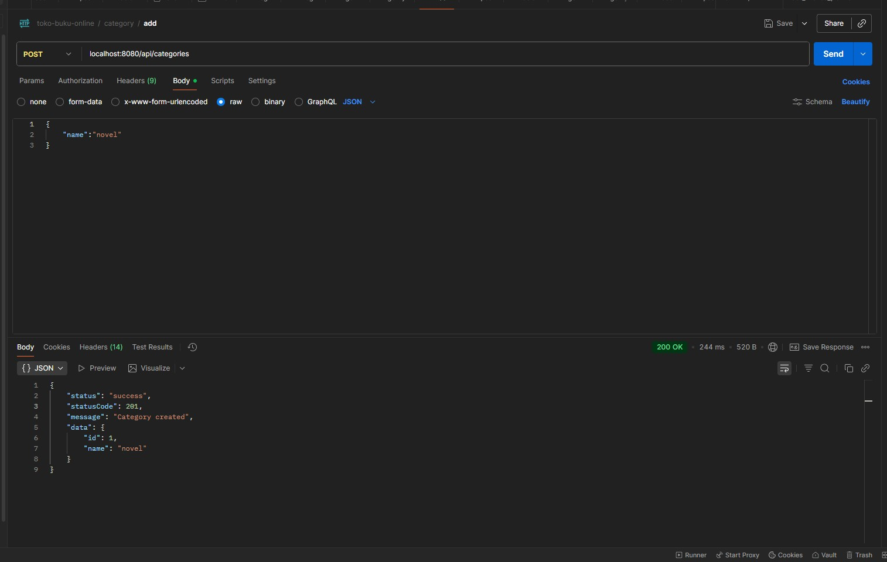

- Get List Category with pagination

  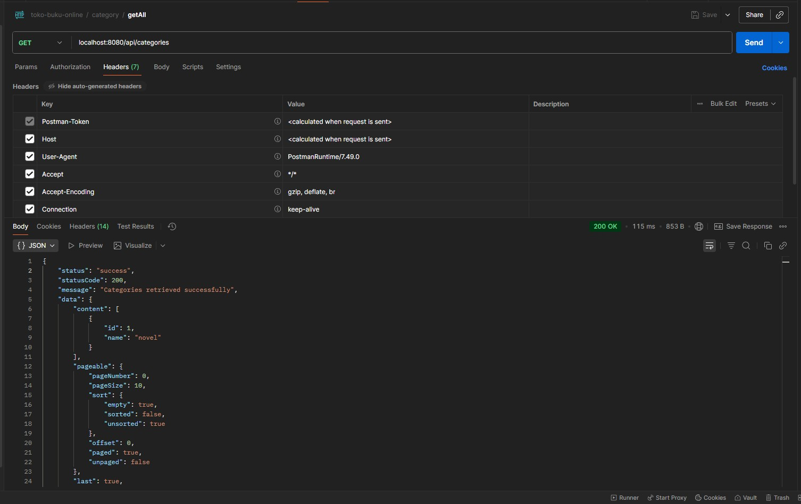

- Create Book

  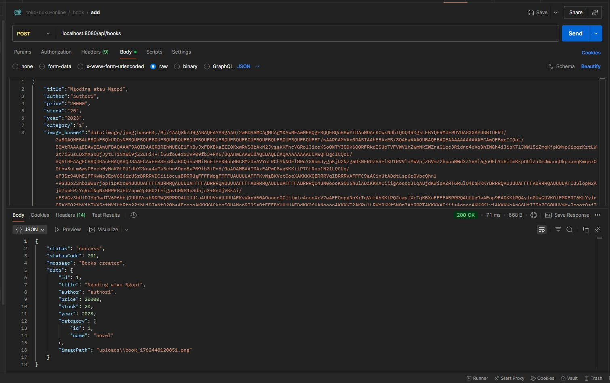

- Get List Book with pagination

  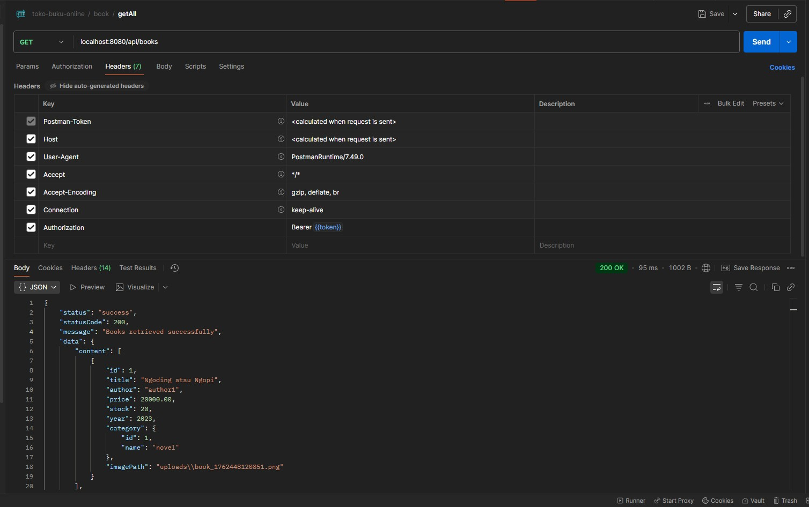

- Create Order

  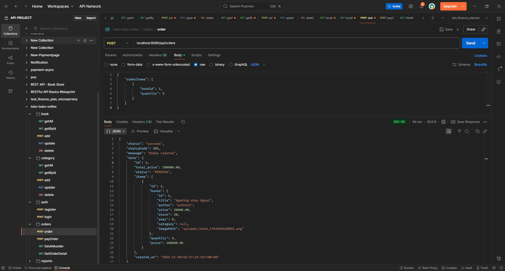

- Create Order

  

- Stok Book Update

  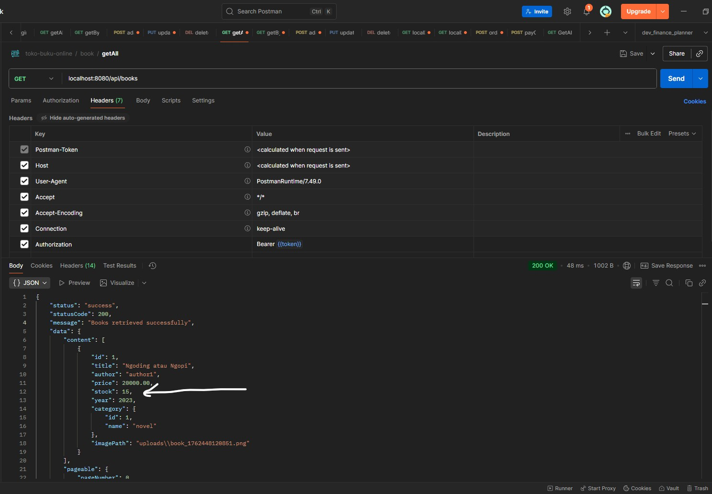

- Create Order (Stock Failed)

  

- Payment

  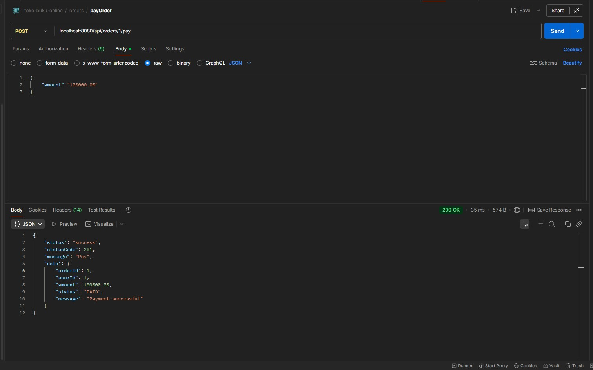

- Get Order List And Check Status Payment

  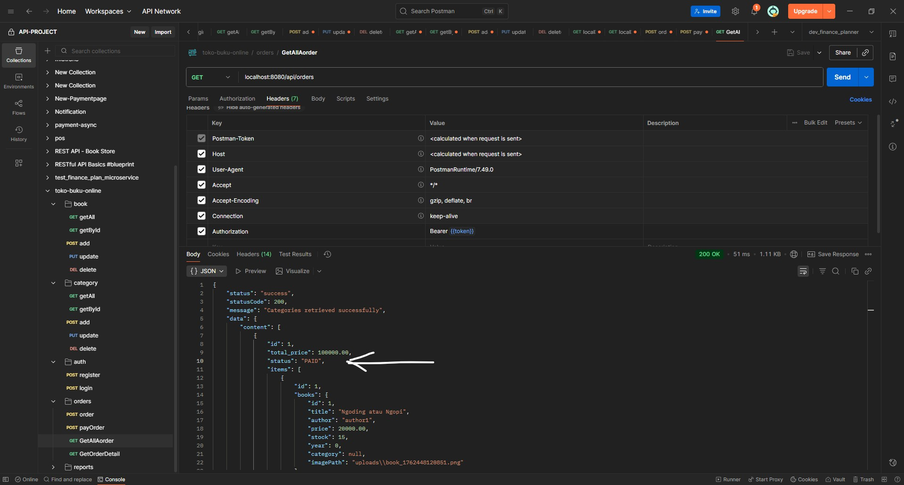

- Payment Failed

  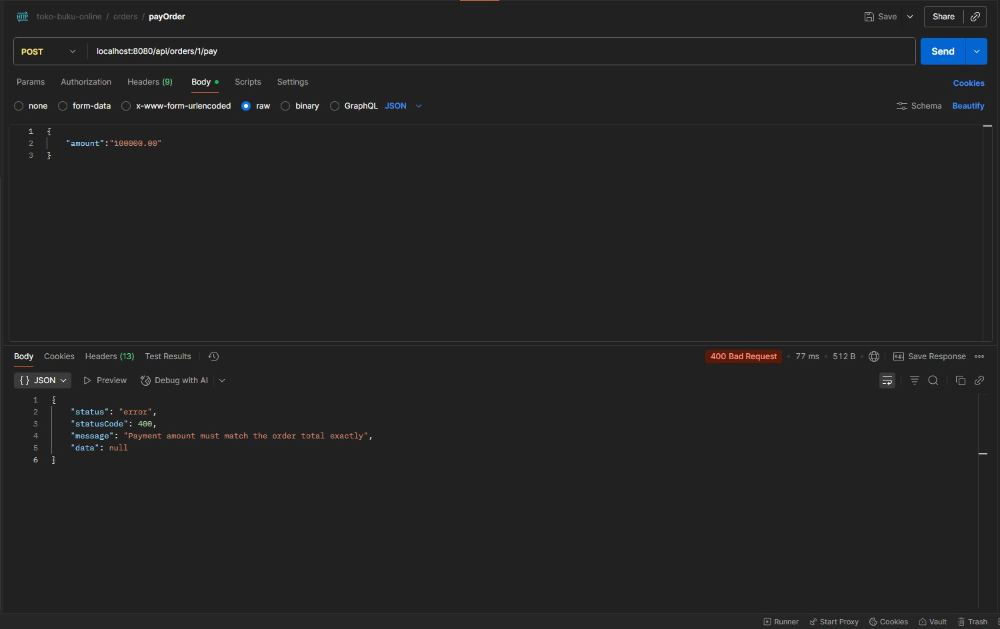

